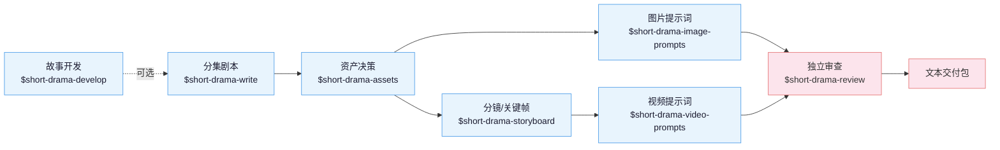

**中文** | [English](README_EN.md)

# 短剧技能套件

面向编剧、漫剧工作室和编导的 AI 短剧创作套件。八个技能把一个点子或一部长篇材料，
一路做成分集剧本、资产设定、图片提示词、分镜关键帧、视频提示词和独立审查记录，
全程用同一套创作者决策、来源引用与连续性契约衔接。适配 Claude Code、Codex 和其他
支持 Agent Skill 规范的运行环境。

产出是文本：剧本、设定、提示词、审查记录。

## 演示

《孤身入魔》演示含项目设定、两集剧本和十二板分镜；下方 15 秒宣传样片为临时展示，非套件默认产物。

https://github.com/user-attachments/assets/ae88b444-06e5-4964-856c-91e619020f12


## 由来

这套技能来自我们自己的漫剧工作室产线：2025 年至今累计上千个 AI 短剧 / 漫剧项目，
中间换过几轮自建和开源工具。前后端加起来近 8 万行代码，在模型能力和需求的迭代速度
面前逐渐维护不动了。

后来干脆抛开图形工具，把历史项目工程和图片 / 视频提示词蒸馏成这套技能，让制作人直接
用 agent CLI 加文件维护工程、生成提示词，确认之后再送去生成——结果意外地顺手。
现在留在自建工具里的，只剩排队抽卡。

**刻意不含生图与生视频**：为防止未经确认的提示词误触发生成、造成预算浪费，套件
不调用真正的图片、视频或音频生成服务。提示词先落进文件、由人确认，再进入生成环节。

## 安装

需要 **Python 3.10 或更新版本**（macOS 自带的 3.9 不够）。直接告诉 Claude Code、
Codex 等支持导入 GitHub 仓库的智能体：

```
安装这个技能套件 https://github.com/worldwonderer/drama-skills
```

<details>
<summary>手动链接（八个技能目录必须保持同级）</summary>

```bash
git clone https://github.com/worldwonderer/drama-skills.git && cd drama-skills

# Claude Code
mkdir -p "$HOME/.claude/skills"
for skill in skills/*; do
  ln -s "$PWD/$skill" "$HOME/.claude/skills/$(basename "$skill")"
done

# Codex
mkdir -p "${CODEX_HOME:-$HOME/.codex}/skills"
for skill in skills/*; do
  ln -s "$PWD/$skill" "${CODEX_HOME:-$HOME/.codex}/skills/$(basename "$skill")"
done
```

已存在同名技能时先移除旧链接，不要混装版本。

</details>

调用写法随运行环境而变：Claude Code 用 `/short-drama`，Codex 用 `$short-drama`，
也可以不写前缀、直接用自然语言说明要做什么。两种写法在下文示例中可以互换。

## 快速开始

```
# 1. 新建项目
用 $short-drama 初始化一个都市打脸题材的短剧项目，竖屏 9:16

# 2. 写第一集
用 $short-drama-write 写第 1 集：外卖员在高档餐厅被经理羞辱，亮出集团董事身份

# 3. 拆资产，写提示词与分镜
用 $short-drama-assets 从第 1 集拆人物/场景/道具
用 $short-drama-image-prompts 为已接受的资产写参考图提示词
用 $short-drama-storyboard 给第 1 集做分镜
用 $short-drama-video-prompts 把分镜逐镜翻译成视频提示词

# 4. 独立审查
用 $short-drama-review 审查第 1 集的剧本与提示词
```

一集完整的摘录链条见 [demo/](demo/)：剧本 → 资产设定 → 分镜 → 视频提示词。

## 八个技能



| 技能 | 职责 |
|---|---|
| `short-drama` | 初始化、路由、状态、异常恢复、接受/审查生命周期与交付 |
| `short-drama-develop` | 小说/长材料的可追溯改编、故事引擎、分集地图、导演阐述、题材与钩子手册 |
| `short-drama-write` | 单集目标、因果节拍、可拍剧本和项目选择的制作稿格式 |
| `short-drama-assets` | 人物/造型、地点/视图、道具/状态与连续性决策 |
| `short-drama-image-prompts` | 角色、场景、道具参考板提示词与定点修改说明 |
| `short-drama-storyboard` | 原文落实、镜头目的、场面调度、连续性边界和冻结关键帧 |
| `short-drama-video-prompts` | 单镜头内的动作、表演、摄影、声音、起止状态与补拍说明 |
| `short-drama-review` | 结构校验、带证据的内容审查、制作质量检查与独立审查结论 |

`$short-drama` 是入口路由，负责初始化、继续、恢复和交付，把具体工作转给对应技能。
现成剧本可以直接进入规范化或资产拆解，点子与长篇材料则从故事开发进入。

两条图像提示词路径职责不同：`image-prompts` 写人物、地点、道具的**可复用参考图**
提示词，`storyboard` 写只代表本镜开始状态的**关键帧**提示词。

## 本地项目控制台

在智能体里一句话启动（Codex 写作 `$short-drama dashboard`）：

```
/short-drama dashboard
```

控制台仅支持 macOS/Linux 本机运行，可按制作阶段编辑文本、预览媒体和查看状态；
临时文件只显示在“全部”视图。

## 致谢

[LINUX DO - The New Ideal Community](https://linux.do) — 社区支持
