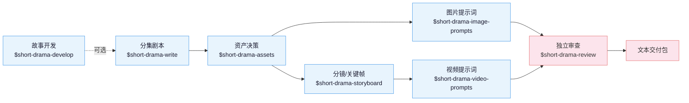

**中文** | [English](README_EN.md)

# 短剧技能套件

面向编剧、漫剧工作室和编导的 AI 短剧创作技能套件。它把点子或长篇材料一路发展为
分集剧本、资产设定、图片提示词、分镜/关键帧、视频提示词和独立审查记录，并用同一套
创作者决策、来源引用与连续性契约衔接各环节。适配 Claude Code、Codex 和其他支持
Agent Skill 规范的运行环境。

当前版本只交付剧本、资产说明、分镜、提示词、审查记录和结构化文本；不调用真正的
图片、视频或音频生成服务，也不从提示词或任务状态声称成片质量。

## 核心思路

三句话贯穿整条制作链：

> 1. **剧本交付可表演、可制作的事实**：优先用行动、证据、调度与对白策略承载
>    意义；VO/OS、屏显文字和表演括注只在创作者有意选择时使用。
> 2. **资产拥有身份与状态，分镜拥有本镜呈现**：参考图版式、背景和视图数量由
>    项目用途决定，让每种构图方案服务明确的复用目标。
> 3. **连续性必须明确记录**：精确比较相邻镜头的已确认边界；提示词只重复当前执行
>    必需的局部锚点，以项目记录作为跨环节协作依据。

除此之外，规则分为四类：可以直接检查的结构要求、需要结合证据判断的内容要求、
通常有帮助的做法，以及由创作者决定的风格选择。创作判断因此保留弹性，确定性工具则
专注保护文件、引用、状态和交付完整性。

题材手册按压力来源、人物策略、观众回报和制作难点选择写法；制作形态卡再把实拍、
2D 动态漫、风格化 3D、水墨等方向翻译成形、层、材质、光、动作与声音，让同一故事
意图在编剧、资产、分镜和提示词之间保持一致。

## 生产链路



`$short-drama` 是入口路由：初始化、继续、恢复和交付项目，把具体工作转给对应
技能。现成剧本可以直接进入规范化或资产拆解，点子与长篇材料则从故事开发进入。

图像提示词有两条职责清晰的路径：`$short-drama-image-prompts` 为人物、地点、道具等
**资产参考图**写复用提示词；`$short-drama-storyboard` 在每个镜头内写只代表该镜开始
状态的**关键帧提示词**。两者共享已接受的资产事实，并分别维护复用设计与本镜呈现。

## 技能

| 技能 | 职责 |
|---|---|
| `short-drama` | 初始化、路由、状态、异常恢复、接受/审查生命周期与交付 |
| `short-drama-develop` | 小说/长材料的可追溯改编、故事引擎、分集地图、导演阐述、题材与钩子手册 |
| `short-drama-write` | 单集目标、因果节拍、可拍剧本和项目选择的制作稿格式 |
| `short-drama-assets` | 人物/造型、地点/视图、道具/状态与连续性决策 |
| `short-drama-image-prompts` | 角色、场景、道具参考板提示词与定点修改说明 |
| `short-drama-storyboard` | 原文落实、镜头目的、场面调度、连续性边界和冻结关键帧 |
| `short-drama-video-prompts` | 单镜头内的动作、表演、摄影、声音、起止状态与补拍说明 |
| `short-drama-review` | 结构校验、带证据的内容审查、制作质量检查与独立审查结论 |

## 安装

**方式一** 直接告诉 Claude Code、Codex 等支持导入 GitHub 仓库的智能体：

```
安装这个技能套件 https://github.com/worldwonderer/drama-skills
```

**方式二** 手动链接（八个技能目录必须保持同级）：

```bash
git clone https://github.com/worldwonderer/drama-skills.git && cd drama-skills

# Claude Code
mkdir -p "$HOME/.claude/skills"
for skill in skills/*; do
  ln -s "$PWD/$skill" "$HOME/.claude/skills/$(basename "$skill")"
done

# Codex
mkdir -p "${CODEX_HOME:-$HOME/.codex}/skills"
for skill in skills/*; do
  ln -s "$PWD/$skill" "${CODEX_HOME:-$HOME/.codex}/skills/$(basename "$skill")"
done
```

已存在同名技能时先移除旧链接，不要混装版本。安装后从主路由技能开始；
具体任务也可以直接调用对应技能。

### 调用写法按运行环境不同

| 运行环境 | 调用写法 |
|---|---|
| Claude Code | `/short-drama`、`/short-drama-write`……，或直接用自然语言描述任务 |
| Codex | `$short-drama`、`$short-drama-write`…… |
| 其他支持 Agent Skill 的环境 | 按该环境的技能调用约定，或直接用自然语言描述任务 |

下文示例统一用 `$` 写法；在 Claude Code 中把 `$` 换成 `/`，或者省略前缀直接说明要做什么。

## 快速开始

```
# 1. 新建项目
用 $short-drama 初始化一个都市打脸题材的短剧项目，竖屏 9:16

# 2. 写第一集（围绕人物选择、局部结果与集间交接组织节拍）
用 $short-drama-write 写第 1 集：外卖员在高档餐厅被经理羞辱，亮出集团董事身份

# 3. 拆资产；按需要并行写资产参考图提示词和分镜关键帧，再写视频提示词
用 $short-drama-assets 从第 1 集拆人物/场景/道具
用 $short-drama-image-prompts 为已接受的资产写参考图提示词
用 $short-drama-storyboard 给第 1 集做分镜
用 $short-drama-video-prompts 把分镜逐镜翻译成视频提示词

# 4. 独立审查
用 $short-drama-review 审查第 1 集的剧本与提示词
```

创作者可读的摘录示例见 [demo/](demo/)：一集剧本 → 资产设定 → 分镜 → 视频提示词。
它展示主要文本交接，不冒充完整项目状态、独立审查或交付包。
