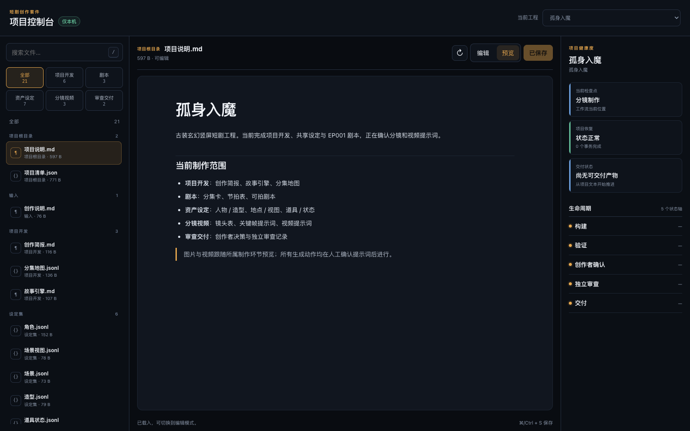
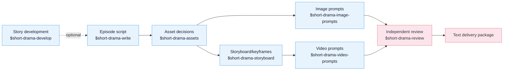

[中文](README.md) | **English**

# Drama Skills

[](https://github.com/worldwonderer/drama-skills/actions/workflows/ci.yml)
[](https://github.com/worldwonderer/drama-skills/releases/latest)
[](https://www.python.org/)
[](LICENSE)

An AI short-drama creation suite for screenwriters, motion-comic studios, and
directors. Eight skills take an idea or a long-form source all the way to episode
scripts, asset decisions, image prompts, storyboard keyframes, video prompts, and
independent review records — carrying creator decisions, source evidence, and
continuity through the entire chain. Works with Claude Code, Codex, and other
runtimes that support Agent Skills.

The output is text: scripts, asset notes, prompts, review records.

## Demo

*Lone Fall into Demonhood* includes project settings, two scripts, and twelve storyboard
panels; the 15-second promo below is a temporary showcase, not a default suite artifact.

https://github.com/user-attachments/assets/ae88b444-06e5-4964-856c-91e619020f12



## Where this came from

These skills come out of our own motion-comic studio's production line: over a
thousand AI short-drama and motion-comic projects since 2025, across several
generations of in-house and open-source tooling. Front end and back end together
reached nearly 80,000 lines, and stopped being maintainable at the pace models and
requirements were moving.

The answer turned out to be dropping the GUI entirely — distilling the historical
project workspaces and image/video prompts into this skill suite, and letting
producers maintain projects and write prompts directly through an agent CLI over
plain files, confirming the prompts before anything goes to generation. It works
noticeably better. What is left of the in-house tooling is the generation queue.

**Image and video generation are deliberately out of scope:** to prevent unreviewed
prompts from accidentally triggering paid generation and wasting budget, the suite
does not call image, video, or audio generation services. Prompts land in files,
receive human confirmation, and only then move to generation.

## Install

Needs **Python 3.10 or newer** (the 3.9 that ships with macOS is not enough).
Just tell Claude Code, Codex, or any agent that can import a GitHub repository:

```
Install this skill suite: https://github.com/worldwonderer/drama-skills
```

<details>
<summary>Manual linking (the eight directories must stay siblings)</summary>

```bash
git clone https://github.com/worldwonderer/drama-skills.git && cd drama-skills

# Claude Code
mkdir -p "$HOME/.claude/skills"
for skill in skills/*; do
  ln -s "$PWD/$skill" "$HOME/.claude/skills/$(basename "$skill")"
done

# Codex
mkdir -p "${CODEX_HOME:-$HOME/.codex}/skills"
for skill in skills/*; do
  ln -s "$PWD/$skill" "${CODEX_HOME:-$HOME/.codex}/skills/$(basename "$skill")"
done
```

Remove any same-named skill links first — do not mix versions.

</details>

Invocation differs by runtime: Claude Code uses `/short-drama`, Codex uses
`$short-drama`, and you can always drop the prefix and just describe the task in
plain language. The two forms are interchangeable in the examples below.

## Quick start

```
# 1. New project
Use $short-drama to init a vertical 9:16 urban face-slapping short-drama project

# 2. Write episode 1
Use $short-drama-write to write EP001: a delivery rider humiliated at a luxury
hotel turns out to be the group chairman

# 3. Extract assets, write prompts and storyboards
Use $short-drama-assets to extract characters/scenes/props from EP001
Use $short-drama-image-prompts to write reference prompts for accepted assets
Use $short-drama-storyboard to storyboard EP001
Use $short-drama-video-prompts to translate each authored shot into a video prompt

# 4. Independent review
Use $short-drama-review to review EP001's script and prompts
```

See [demo/](demo/) for one episode's full excerpt chain: script → asset sheets →
storyboard → video prompts.

## The eight skills



| Skill | Responsibility |
|---|---|
| `short-drama` | Init, routing, state, recovery, acceptance/review lifecycle, delivery |
| `short-drama-develop` | Traceable novel/long-form adaptation, story engine, episode map, director brief, genre & hook playbook |
| `short-drama-write` | Episode contract, causal beats, performable screenplay, and the project's accepted production dialect |
| `short-drama-assets` | Character/Look, Location/View, Prop/State, continuity decisions |
| `short-drama-image-prompts` | Reusable character/location/prop reference prompts and scoped edit instructions |
| `short-drama-storyboard` | Source coverage, motivated shots, staging/continuity boundaries, and frozen keyframe prompts |
| `short-drama-video-prompts` | Ordered action, performance, camera/audio intent, timing, and exact start/end continuity |
| `short-drama-review` | Structural validation, evidence-based review, production quality gates, independent verdicts |

`$short-drama` is the entry router: it initializes, resumes, recovers, and delivers
projects, dispatching the actual work to the matching skill. An existing screenplay
can enter normalization or asset extraction directly; an idea or long-form source
enters through story development.

The two image-prompt paths have distinct ownership: `image-prompts` writes
**reusable reference** prompts for characters, locations, and props, while
`storyboard` writes **keyframe** prompts representing each shot's start state.

## Local project dashboard

One line inside your agent (Codex writes `$short-drama dashboard`):

```
/short-drama dashboard
```

The dashboard runs locally on macOS/Linux. It organizes text editing, media previews,
and project status by production stage; ad-hoc files remain under **All**.
